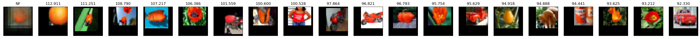
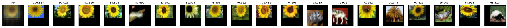

# Neuron Feature (Pytorch)
This repo provides a Pytorch implementation of the Neuron Feature (NF) CNN filter visualization method introduced in [Color encoding in biologically-inspired convolutional neural networks](https://www.sciencedirect.com/science/article/pii/S0042698918300592). For a given Pytorch model, it generates a weighted average of the highest activation input patches for each filter in the final layer.

The code is compatible with [Group Equivariant Convolutions](https://github.com/adambielski/GrouPy) in which case a separate NF is generated for each group element.

Uses [pytorch-receptive-field](https://github.com/Fangyh09/pytorch-receptive-field) for auto calculating the receptive field of the final layer. Tested on `pytorch 1.3.0` and `torchvision 0.4.1`.

#### Usage

1. `git clone https://github.com/Attila94/neuron-feature`

2. Run `example.py`.

This generates the neuron features for VGG16 on the CIFAR100 test set.

Example outputs for filters 20 and 33:

> Note: The generated NFs contain input padding (black borders), required due to the large receptive field of VGG16 and small resolution of CIFAR100. A higher resolution dataset is better suitable for generating NFs.

#### Known limitations

- Receptive field calculation for residual connections not implemented / tested

Please report all other issues.
